# Architecture

## What this is

A self-hosted license issuance and delivery platform: reacts to
confirmed Stripe payments, issues cryptographically signed software
licenses, enforces per-seat activation, and delivers the result by
email — with no per-transaction fee, no per-user cap, and no
dependency on any third-party licensing vendor's uptime.

It does not process payments itself — Stripe owns checkout, card
handling, and fraud screening. This system begins where Stripe's
webhook ends.

It is deliberately product-agnostic. It has no knowledge of what it's
selling — a product is just a short, exactly-4-character code
(`BOOK`, etc.) attached to a Stripe Price. Adding a new product to
sell is a config change, not new architecture.

## The two programs

### quartermaster (`cmd/quartermaster`)

Runs on the public droplet. Owns:
- Receiving and verifying Stripe webhooks
- Enforcing checkout-level business rules (US-only, seat floor and
  ceiling) before a sign request is ever queued
- Queuing sign requests
- Serving the sign queue to the signer, over WireGuard only
- Receiving signed results back from the signer
- Enforcing per-seat license activation and deactivation
- Sending the final license by email (Resend)

It never holds the private signing key. It cannot mint a license on
its own — only queue a *request* for one.

### signer (`cmd/signer`)

Runs on trusted hardware — currently a home machine, never the
droplet. Owns:
- The private Ed25519 signing key (`signing.key`), which never leaves
  this machine
- Polling quartermaster's queue over WireGuard — the signer always
  initiates this connection; quartermaster can never reach into the
  signer
- Checking that a queued request has a recognized product code
  (this is a sanity check on the *request*, distinct from license
  verification, which happens later using only the public key)
- Issuing signed licenses
- Posting results back to quartermaster

If the droplet is ever fully compromised, the attacker gains the
ability to submit sign *requests* through a logged, rate-limited
choke point — never the ability to mint a license, because the key
that can do that was never there. And regardless of which side
initiates a connection, the private key itself never crosses the
wire in either direction — it is generated once, on the signer
machine, by `cmd/keygen`, and stays there.

## Why the split exists

This is the core security property of the whole system: **the
machine exposed to the internet cannot forge licenses, and the
machine that can forge licenses is never exposed to the internet.**

A "hot key" design — private key sitting on the public server — is
simpler but means a single droplet compromise can mint unlimited
valid licenses, silently, forever. This design trades a small amount
of operational complexity (two machines instead of one, a tunnel
between them) for making that failure mode structurally impossible
rather than merely unlikely.

## Data flow: a purchase, end to end

A purchase is one Stripe Checkout session, but may contain several
distinct products and quantities — a cart, not a single item. The
flow below reflects that: one webhook fires per session, but it can
produce several sign requests and always produces exactly one
receipt email, however many products were in the cart.

1. Customer checks out — one or several products, softstore builds a
   single Stripe Checkout Session for the whole cart.
2. Stripe sends `checkout.session.completed` to
   `https://quartermaster.<domain>/stripe/webhook`.
3. quartermaster verifies the HMAC signature (Stripe-Signature
   header) over the raw, unparsed request body, checks the request
   is fresh (replay defense, 5-minute window), checks the customer's
   billing country is US (Radar + this check are defense in depth
   for each other).
4. quartermaster fetches the session's real line items from Stripe
   (quantities, Price IDs) rather than trusting webhook metadata for
   cart contents, and rejects the whole session if total units
   exceed 24, the same integrity ceiling as before.
5. For each unit purchased, quartermaster resolves the Stripe Price
   ID to a product code by calling softstore's internal API over
   WireGuard, then enqueues one single-seat `sign_requests` row per
   unit — a cart of three distinct products becomes three rows, not
   one row with `seats: 3`.
6. The signer, long-polling `GET /queue/wait` over its own WireGuard
   tunnel, picks up each request independently and in whatever order
   they're queued.
7. For each request, the signer verifies it has a recognized product
   code, then calls `license.Issue` with the private key to produce
   a signed, Ed25519-backed license, and posts the result to `POST
   /queue/complete`.
8. Each time a unit is marked `signed`, quartermaster checks whether
   every other unit belonging to the same Checkout Session is also
   signed. Only once the whole session is complete does it fetch the
   session's full line-item detail from Stripe (names, per-item
   price, tax) and send one combined receipt email listing every
   product and license key together — never one email per item.
9. If the purchase went through softstore's cart (rather than a
   single-item "buy now"), the session carries a cart token in its
   metadata; once the combined email has been sent, quartermaster
   calls softstore's internal API to clear that cart, so a completed
   order doesn't linger and reappear on the customer's next visit.
10. The customer's app calls `POST /license/activate` once per
    license, on first run, with the license key and a local machine
    fingerprint.
11. quartermaster verifies the license signature independently
    (using only the *public* key — no trust in the signer required
    at this step), checks the license isn't revoked, checks a seat
    is available, and records the activation.
12. Every subsequent app launch is fully offline — no further
    network calls unless the user explicitly deactivates.

Separately, and optionally: softstore's thank-you page polls
`GET /internal/sessions/{id}/status` (a third listener, see below)
every few seconds after checkout, so the receipt and license keys
can appear directly on the page — the same combined-receipt data as
the email, available slightly before or around the same time the
email itself arrives. This is a convenience for the buyer, not part
of the fulfillment path itself; if softstore or the poll never
succeeds, the email still arrives via steps 8–9 regardless.

## The license itself

Ed25519 signature over a fixed 33-byte payload: format version,
license ID, product code, major version, seat count, issue
timestamp. 97 raw bytes total (33 payload + 64 signature),
base32-encoded (no padding) and dash-formatted for display.

The version byte is stamped by `Issue` alone — never taken from
caller input — and `Verify` rejects an unrecognized version before
attempting signature verification, since an unrecognized version
means the rest of the byte offsets aren't trustworthy to begin with.

Verification requires only the public key, embedded in every
customer-facing app. It does not require network access, a server,
or any component of this platform to still exist. A license issued
today will still verify in twenty years even if this entire platform
is gone.

See `docs/license-scheme.md` for the full byte layout, threat model,
and business rules (seat limits, product code format). See
`license/license_test.go` for the tamper/forgery tests this claim is
based on.

## Licensing model: one online activation, offline forever after

Activation is the single deliberate network dependency in the entire
licensing lifecycle. It exists to close one specific gap: without
it, a shared key posted publicly (a Discord server, a forum) would
let an unlimited number of strangers all "activate" independently,
since no single machine has any way of knowing the key was already
used elsewhere. The one-time server check is the only place that
knowledge can live.

After activation succeeds, the app is fully offline. There is no
periodic check-in, no expiry, no phone-home of any kind, ever again,
unless the user deactivates.

### Seats

A license's `Seats` field (in the signed payload) is the ceiling on
simultaneous activations. The server counts non-revoked activations
per license and refuses new ones once the count reaches the seat
limit — *except* for a fingerprint that's already activated, which
is always allowed through (idempotent reactivation, not a new seat).

### Deactivation and resale

An explicit, user-triggered action. Frees the seat server-side and
wipes the local activation record client-side. A deactivated license
is fully transferable — the recipient activates fresh, consuming the
now-free seat. This is the same model as reselling physical media:
the platform doesn't try to track *who* legitimately owns a license
after the first sale, only *how many machines* are using it at once.

### What this does not and cannot prevent

- A single legitimate buyer running one copy on one machine forever,
  even after a refund or chargeback — the signature doesn't know or
  care about payment status, by design. This is treated as an
  acceptable, bounded cost, not a bug.
- A careful, honest chain of deactivate → hand off → reactivate. This
  is treated as equivalent to reselling a physical good.

### What it does prevent

- Mass sharing of a single key to many simultaneous, never-before-seen
  machines (the Discord scenario) — the second activation attempt is
  refused outright.
- Resale or reactivation of a license whose payment has been disputed
  (`revoked` flag, set manually today, checked automatically on every
  activation attempt).

## Trust boundaries

| Component | Can do | Cannot do |
|---|---|---|
| Droplet (quartermaster) | Verify licenses (public key), queue requests, enforce business rules and seats, send email, look up product codes and clear carts on softstore (shared-secret-authenticated) | Mint new licenses |
| Signer (home machine) | Mint licenses (private key), initiate connections to the droplet | Accept inbound connections from anywhere |
| Customer's app | Verify its own license (public key) | Verify *other* licenses, or forge one |
| Softstore (separate droplet) | Look up fulfillment status for its own checkout sessions (shared-secret-authenticated) | Read fulfillment status for a session it didn't create, mint or resolve licenses, reach quartermaster except over the dedicated WireGuard tunnel |

Quartermaster and softstore trust each other only as far as the
shared secret and the WireGuard tunnel between them extend — neither
service exposes its internal endpoints publicly, and the secret
authenticates the *service*, not any individual request's contents
(there's no per-session authorization; softstore could poll the
status of a session it didn't originate if it knew the ID, since
session IDs function as unguessable-in-practice random tokens, not a
capability check). This is an accepted, narrow trust boundary: both
services are operated by the same person, on infrastructure only
that person controls.

## Components

- **`license`** — the signed payload format itself: construction,
  signing, verification. See `docs/license-scheme.md` for the full
  spec.
- **`queue`** — owns the `sign_requests` table: enqueueing from the
  webhook, long-polling for pending work, marking requests signed or
  rejected. Used only by quartermaster's webhook and queue-API
  handlers.
- **`activations`** — owns the `activations` table: per-seat
  activation, deactivation, revocation checks. Used only by
  quartermaster's activation-API handlers.
- **`queue` and `activations` share one SQLite connection**, opened
  once in `cmd/quartermaster/main.go`, each owning only its own
  table and queries. They were split into separate packages because
  they represent genuinely different responsibilities (payment-driven
  work queue vs. ongoing license enforcement) that happened to start
  in one file for convenience, not because they share any real logic.

## Deployment

- **quartermaster**: cross-compiled (`CGO_ENABLED=0 GOOS=linux
  GOARCH=amd64`), shipped via `./deploy.sh` (tests → build → scp to
  a staging directory → an `inotifywait`-based watcher on the droplet
  detects the new binary and redeploys automatically). Runs as a
  systemd service, three listeners: a loopback-only webhook port
  behind Caddy (public HTTPS, real Let's Encrypt cert), a WireGuard-
  interface-only queue API port on the signer's tunnel (`10.46.0.0/24`,
  never reachable from the public internet), and a second, separate
  WireGuard-interface-only port on a distinct tunnel to softstore
  (`10.20.0.0/24`) — two tunnels, not one, because the signer and
  softstore are different trust relationships with different peers;
  collapsing them into one tunnel would mean a compromise of either
  peer has network-level reach toward the other.

- **signer**: runs as a systemd service on the home machine, boots
  independent of any login session, polls the tunnel continuously.
  Never deployed anywhere else.

See `docs/operations.md` for deploy steps, key ceremony, backups, and
the incident runbook.

## What's tested

Every trust boundary has real test coverage: signature verification
(valid, tampered, wrong secret, expired, malformed, unrecognized
version), the webhook's business logic (country gate, unit-count
ceiling, per-unit enqueue with real Stripe line-item fakes standing
in for the network call), the queue's idempotency and concurrency
behavior (long-poll, timeout, cancellation), the session-completion
logic specifically — a session with one item pending is correctly
excluded from "ready," a fully-signed multi-item session correctly
includes every item, a session's email is sent exactly once even
under retry — the signer's full HTTP and cryptographic path (mocked
server, real key generation, real license verification), the
activation model's seat math (single-seat, multi-seat, same-machine
idempotency, resale flow), the internal status endpoint's shared-
secret rejection, and the keygen tool's file-permission guarantees.
See each package's `*_test.go` for specifics.
